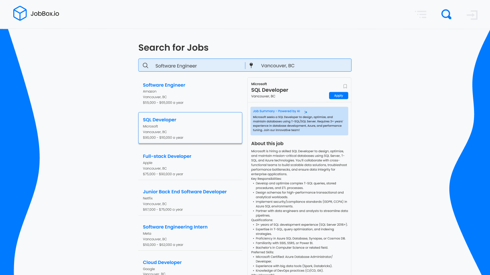
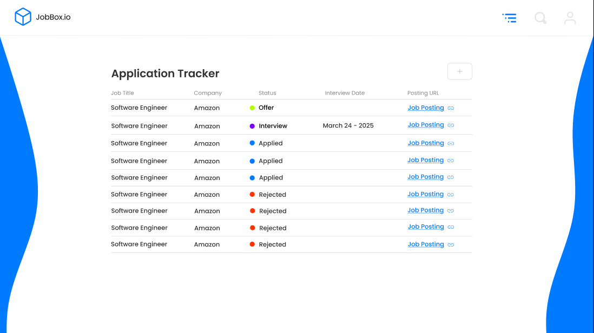

# 🚀 jobBox: Your AI-Powered Job Search Companion

**Tired of endless scrolling through irrelevant job postings?** jobBox revolutionizes your job hunt with a **centralized, AI-driven platform** that aggregates high-quality opportunities, tracks applications, and simplifies your search.

---

## 🔍 Why jobBox?

### **The Problem**

-   🧩 **Information Overload**: 90% of job boards drown you in irrelevant postings
-   🌐 **Fragmented Search**: Jumping between 10+ websites wastes time and energy
-   🤯 **Clunky Interfaces**: Poor UX makes job hunting stressful and inefficient

### **The Solution**

jobBox tackles these pain points head-on with:

-   🎯 **AI-Curated Job Feed**: Get only the roles that match your skills and goals
-   🌟 **All-in-One Platform**: Access postings from LinkedIn, Indeed, Glassdoor, and niche boards
-   ✨ **Sleek, Intuitive Design**: Spend less time searching, more time applying

---

## 🚀 Key Features

### **✨ AI Job Match Assistant**

-   **Smart Filters**: NLP-powered search understands "marketing roles in NYC with $80k+ salary"
-   **Priority Score**: AI ranks jobs by fit, saving you 10+ hours/week

### **📊 Application Tracker**

-   Visual dashboard to monitor applications (Applied → Interview → Offer)
-   Set reminders for follow-ups and deadlines

### **💾 Save for Later**

-   Bookmark jobs in custom lists (e.g., "Remote Roles", "Tech Startups")

### **🔍 Unified Search**

-   One search bar queries multiple job boards instantly

---

## ⚙️ Tech Stack

-   **Frontend**: React + TypeScript
-   **Backend**: Firebase
-   **APIs**: RapidAPI, OpenAI API

---

## 💡 Getting Started

### Prerequisites

-   Node.js v18+

### Installation

```bash
git clone https://github.com/yourusername/jobBox.git
cd jobBox
npm install
npm run dev
```

---

## Basic Usage

### 🔐 Register & Login

Choose between email registration or Google login

Get started in 30 seconds with minimal onboarding


### 🔍 Browse & Search Jobs

Use the AI-powered search bar ("Software developer jobs in Vancouver, BC")

Apply filters: Location, Salary Range, Experience Level


### 💾 Save & Track Applications

Click 📑 to save jobs to custom lists

Monitor application status in the visual tracker dashboard


---

## 🎉 Special Thanks

A huge thank you to DreamHacks 2025 for hosting an incredible hackathon and providing a platform to bring this idea to life. This project wouldn't have been possible without the inspiration, resources, and energy from the event and its participants.

---
